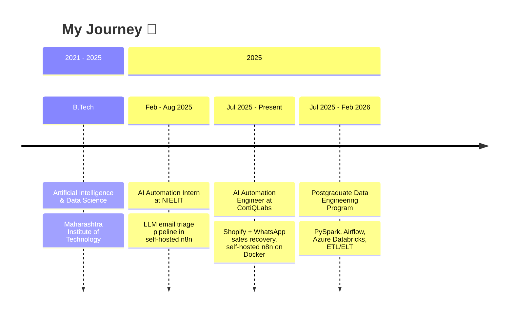

<div align="center">


### 🚀 **Who Am I?**
*Connecting APIs, databases and LLMs into workflows that run reliably on their own*

</div>

<table>
<tr>
<td width="60%">

```python
class JayeshProfile:
    def __init__(self):
        self.name = "Jayesh Vinayak Dhamne"
        self.role = "AI Automation Engineer"
        self.company = "CortiQLabs (Remote)"
        self.location = "Pune, Maharashtra, India"
        self.passion = "Reliable, monitored automation systems"

    def current_focus(self):
        return [
            "🔧 Self-hosted n8n on Docker",
            "🧠 LLM classification, AI agents & RAG",
            "🛒 Shopify + WhatsApp Business automation",
            "📊 Data engineering: PySpark, Airflow, Databricks",
        ]
```

</td>
<td width="40%">

**🎯 Quick Stats**<br><br>
💼 AI Automation Engineer @ CortiQLabs<br>
📈 25-30% sales increase via cart-recovery automation<br>
📨 20-25% less manual email sorting (LLM triage)<br>
☁️ Microsoft Azure Fundamentals (AZ-900)<br>
🎓 B.Tech, AI & Data Science (2021-2025)

</td>
</tr>
</table>

---

## 🛠️ Tech Arsenal

### 🔧 n8n & Workflow Automation


### 🔌 Integrations & CRM


### 💻 Languages


### 🤖 AI & LLMOps


### 🗄️ Databases & Vector Stores


### 📊 Data Engineering


### ☁️ Cloud & DevOps


---

## 💼 Professional Journey



---

## 🏆 Certifications & Education

| Credential | Issuer |
| --- | --- |
| **Microsoft Certified: Azure Fundamentals (AZ-900)** | Microsoft |
| **Microsoft Certified: Power Platform Fundamentals** | Microsoft |
| **Data Analytics using Python** | NPTEL |
| **Postgraduate Data Engineering Program** | PySpark, Spark, Airflow, Azure Databricks, ETL/ELT |
| **B.Tech, Artificial Intelligence & Data Science** | Maharashtra Institute of Technology (2021-2025) |

---

## 💎 Featured Projects

| Project | What it does | Stack |
| --- | --- | --- |
| 🛒 **Shopify Sales & Abandoned-Cart Recovery Automation** | Monitors Shopify sales and abandoned carts, sends targeted WhatsApp follow-ups, and logs recovery data to Google Sheets | `n8n` `Shopify API` `WhatsApp Business API` `Google Sheets` `Apps Script` |
| 📧 **AI Email Triage & Routing System** | Uses an LLM to classify intent and priority of incoming emails and routes them to the right teams with structured outputs | `n8n` `LLM Classification` `Email` `JavaScript` |
| 📄 **AI-Powered Resume Screening System** | Parses candidate submissions, scores resumes against job descriptions with an LLM, and sends shortlisted profiles to HR on Slack | `n8n` `LLM` `JavaScript` `Webhooks` `Slack` |

---

## 🤝 How I Can Help

- 🔧 **Workflow automation:** n8n, REST/GraphQL APIs, webhooks, CRMs, Shopify and WhatsApp integrations
- 🧠 **LLM-powered pipelines:** classification, routing, AI agents, RAG
- 🛡️ **Reliability:** retries, error handling, execution logging and monitoring built into every workflow
- 📊 **Data pipelines:** ETL/ELT with PySpark, Airflow and Azure Databricks

---

## 📊 GitHub Analytics

<div align="center">


</div>

---

## 📫 Let's Connect

<div align="center">

[](https://www.linkedin.com/in/jayesh-dhamne/)
[](https://github.com/jayeshdhamne)
[](mailto:dhamne.jayesh2002@gmail.com)


</div>
